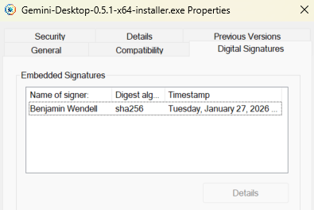

# Transparency Report

> **"Sunlight is the best disinfectant."**

This document exists to provide complete transparency into what Gemini Desktop does, how it works, and who built it. In light of malware masquerading as open-source tools, trust must be earned through verification, not just promises.

## ⚠️ The "GeminiDesk" Malware Warning

You may have seen warnings on Reddit about a similar-sounding app called "GeminiDesk" that contained surveillance software. **That is NOT this application.**

Here is a direct comparison of the malicious behaviors found in that clone versus how Gemini Desktop operates:

| Malicious Behavior (GeminiDesk)                                      | Gemini Desktop (This App)                                                                                                                           | Verification                                                   |
| -------------------------------------------------------------------- | --------------------------------------------------------------------------------------------------------------------------------------------------- | -------------------------------------------------------------- |
| **Credential Theft** Captures email/password fields               | **❌ No Access** Authentication is handled entirely by Google's login page. The app never sees your credentials.                                 | [View Auth Code](../src/main/windows/authWindow.ts)            |
| **Cookie Exfiltration** Zips cookies and sends to external server | **❌ Local Only** Cookies are stored encrypted on your local machine, just like Chrome. They are never transmitted anywhere except `google.com`. | [View Session Code](../src/main/utils/security.ts)             |
| **Hidden Files** Uses `.svchost` and `attrib +H` to hide files    | **❌ Standard Install** Installs to standard OS application folders. No hidden system files.                                                     | [View Installer Config](../config/electron-builder.config.cjs) |
| **External Code** Downloads `MicrosoftEdgeUpdate.exe` from GitHub | **❌ No External Downloads** The app is self-contained. It never downloads executable code from the internet.                                    | [View Security Policy](../src/main/utils/security.ts)          |
| **Persistence** Uses `takeown` to lock files                      | **❌ No Persistence** Uninstalling the app removes it completely.                                                                                |                                                                |

---

## 🌐 Network Activity

We believe you should know exactly who your computer is talking to. Gemini Desktop **ONLY** communicates with these domains:

| Domain             | Purpose                                                      |
| ------------------ | ------------------------------------------------------------ |
| `*.google.com`     | Loading the Gemini web interface and authentication.         |
| `*.gstatic.com`    | Google static assets (images, scripts).                      |
| `*.googleapis.com` | Google API calls required for the web interface.             |
| `api.github.com`   | Checking for app updates (metadata only, no user data sent). |

**We do not have a backend server.** There is no "Gemini Desktop Cloud." All data flows directly between your machine and Google.

---

## � Navigation Security

Malicious apps often redirect users to phishing sites or load remote payloads from attacker-controlled servers. Gemini Desktop blocks these attack vectors at the code level:

| Protection                   | Description                                                                                              | Verification                                                  |
| ---------------------------- | -------------------------------------------------------------------------------------------------------- | ------------------------------------------------------------- |
| **URL Allowlist**            | Navigation is restricted to `gemini.google.com` and Google OAuth domains. All other URLs are blocked.    | [View Navigation Handler](../src/main/windows/mainWindow.ts)  |
| **External Links → Browser** | Clicking a non-Google link opens your system browser, not inside the app. The app cannot be hijacked.    | [View Window Open Handler](../src/main/windows/mainWindow.ts) |
| **Permission Lockdown**      | Camera and microphone access is only granted to `*.google.com` domains. All other requests are denied.   | [View Permission Handler](../src/main/utils/security.ts)      |
| **Domain Constants**         | Allowed domains are defined in a single, auditable file—no hidden allowlists scattered through the code. | [View Domain Config](../src/main/utils/constants.ts)          |

---

## �🔐 Data Privacy

### What We Store Locally

- **Cookies & Session Tokens**: Encrypted by Electron (Chromium) standard protections.
- **Window State**: Last position and size of the window.
- **Preferences**: Your settings for the app (e.g., "Always on Top").

### What We NEVER Collect

- ❌ Your prompts or chat history
- ❌ Your email or password
- ❌ Telemetry or usage analytics
- ❌ System information beyond what's needed for the OS window

---

## 👨‍💻 About the Developer

Malware is often distributed by anonymous accounts that disappear quickly. I am a real person with a professional reputation to uphold.

**Ben Wendell**

- **GitHub**: [@bwendell](https://github.com/bwendell) (Active since 2012)
- **Website**: [benwendell.com](https://benwendell.com)
- **LinkedIn**: [Benjamin Wendell](https://linkedin.com/in/benjamin-wendell)

I built this tool because I wanted a better way to use Gemini on my desktop. I use it daily myself.

---

## ✍️ Windows Code Signing

All Windows releases are **digitally signed** using [Azure Trusted Signing](https://learn.microsoft.com/en-us/azure/trusted-signing/overview).

This means:

- **Microsoft has verified my identity** before issuing the certificate
- **Windows SmartScreen** will recognize the application as trusted
- **You can verify the signature** by right-clicking the `.exe` → Properties → Digital Signatures

> [!IMPORTANT]
> Malware authors avoid code signing because it creates a traceable paper trail. A signed executable is a strong signal that the developer is accountable.

  

---

## 🛡️ Verify Your Download

To ensure you have the genuine, unaltered version of Gemini Desktop:

1. **Only download** from the [Official Releases Page](https://github.com/bwendell/gemini-desktop/releases).
2. **Check the Checksum**: We publish a checksum file for each platform with every release.
    - **Windows (PowerShell)**: `Get-FileHash .\Gemini-Desktop-Setup.exe` — compare with `checksums-windows.txt`
    - **Mac**: `shasum -a 256 Gemini-Desktop.dmg` — compare with `checksums-mac.txt`
    - **Linux**: `sha256sum Gemini-Desktop.AppImage` — compare with `checksums-linux.txt`

If you find _anything_ suspicious, please open an issue or contact me directly.
